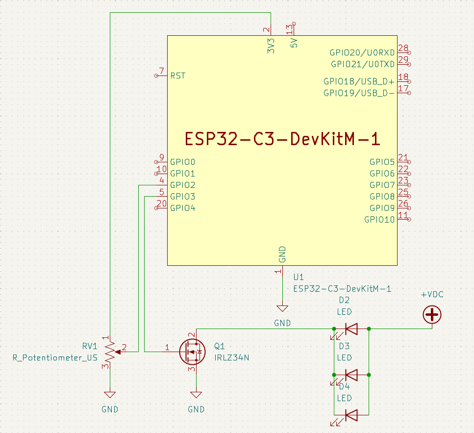

# Light Table Controller
Once upon a time, the library had a light table. The kids played with it, and all was happy and wonderful. Then it broke, and everyone was sad.

So yeah, essentially we have a light table in the youth area for kids to play with, and the switch on it broke. We decided to fix it ourselves and make it cooler in the process. Now, instead of a simple switch, it has a dial that allows you to control brightness. Further, you now don't need to remember to turn it off, as it will detect its own inactivity and turn itself off after a configurable amount of time. Yay microcontrollers!

## How does it work?
The circuit controlling all of this is farily simple using a few off the shelf components:

```
U1.............ESP32-C3-DevKitM-1, MCU
RV1............1k Potentiometer
Q1.............IRLZ32N N-Channel MOSFET
D2, D3, D4.....12 VDC LEDs representing the LED strip
+VDC...........12 VDC 2 A power supply
```
The program essentially works by continuously reading RV1 with the ESP32-C3's ADC. (That's Analog to Digital Converter.) This allows us to see how far the knob of the potentiometer is turned. We can then use this to vary the power going to the output pin on the MCU. The output pin is connected to an N-Channel MOSFET, which allows us to use the tiny current produced by the MCU to control a large current. In this case, a set of LEDs on a strip. (In reality, it's a bit more complicated than just varying power because LEDs are weird. If you want to learn more about how this actually works, look up the concept of a "duty cycle" as it relates to electronics, as that is actually how this is controlled.)

## Why didn't you just replace the switch with a new one?
Because that's boring.